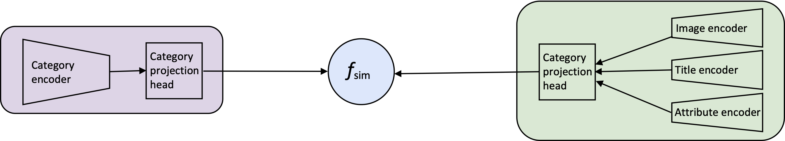

# Object-centric vs. Scene-centric Image-Text Cross-modal Retrieval

This repository contains the code used for the experiments in "[Object-centric vs. Scene-centric Image-Text Cross-modal Retrieval: A Reproducibility Study](https://mariyahendriksen.github.io/files/ecir23.pdf)" published at ECIR 2023.

<div align="center">

  [](https://arxiv.org/abs/2301.05174)
  [](https://pytorch.org/)
  [](https://opensource.org/licenses/MIT)
</div>



## License
The contents of this repository are licensed under the MIT license. If you modify its contents in any way, please link back to this repository.


## Reproducing Experiments

First off, install the dependencies:
```bash
pip install -r requirements.txt
```

### Download the data
Download the data from [this repository](https://zenodo.org/record/7298031#.Y2jgU-zMLtV). The repository contains two zip files: `CLIP_data.zip` and `X-VLM_data.zip`


After unzipping `CLIP_data` put the resulting `data` folder in the `CLIP` folder:

```angular2html
CLIP/
    data/
        datasets/
        results/
```


For evaluating X-VLM, we need to have access to the original images from [CUB-200 (CUB)](http://www.vision.caltech.edu/datasets/cub_200_2011/), [Amazon Berkley Objects (ABO)](https://amazon-berkeley-objects.s3.amazonaws.com/index.html), [Fashion200k](https://github.com/xthan/fashion-200k), [MS COCO](https://cocodataset.org), and [Flickr30k](https://shannon.cs.illinois.edu/DenotationGraph/). We cannot redistribute the images, therefore, we ask you to download the images yourself. The images should be added to the `X-VLM/image` directory, each dataset in its own subfolder folder.
Overall the X-VLM folder should organized as follows:

```angular2html
X-VLM/
    data/
        json_splits/
        models/
    images/
        cub/
            001.Black_footed_Albatross/*.jpg
            ...
            174.Palm_Warbler/*.jpg
        fashion200k/
            women/
                dresses/*.jpg
                jackets/*.jpg
                pants/*.jpg
                skirts/*.jpg
                tops/*.jpg
        abo/
            00/*.jpg
            ...
            fe/*.jpg
        mscoco/*.jpg
        flickr30k/*.jpg
```

### Evaluate the models
Evaluate each model on each of the five datasets.

```bash
# CLIP evaluation
sh CLIP/jobs/evaluation/evaluate_cub.job
sh CLIP/jobs/evaluation/evaluate_abo.job
sh CLIP/jobs/evaluation/evaluate_fashion200k.job
sh CLIP/jobs/evaluation/evaluate_mscoco.job
sh CLIP/jobs/evaluation/evaluate_flickr30k.job
# printing the results for CLIP in one file
sh CLIP/jobs/postprocessing/results_printer.job

# X-VLM evaluation
sh X-VLM/jobs/evaluation/evaluate_flickr30k.job 
sh X-VLM/jobs/evaluation/evaluate_cub.job 
sh X-VLM/jobs/evaluation/evaluate_abo.job 
sh X-VLM/jobs/evaluation/evaluate_fashion200k.job 
sh X-VLM/jobs/evaluation/evaluate_mscoco.job 
# printing the results for X-VLM in one file
sh X-VLM/jobs/postprocessing/results_printer.job
```

## Citing and Authors
If you find this repository helpful, feel free to cite our paper "[Object-centric vs. Scene-centric Cross-modal Retrieval: A Reproducibility Study](https://mariyahendriksen.github.io/files/ecir23.pdf)":

```latex
@inproceedings{hendriksen-2023-object-centric,
author = {Hendriksen, Mariya and Vakulenko, Svitlana and Kuiper, Ernst and de Rijke, Maarten},
booktitle = {ECIR 2023: 45th European Conference on Information Retrieval},
month = {April},
publisher = {Springer},
title = {Scene-centric vs. Object-centric Image-Text Cross-modal Retrieval: A Reproducibility Study},
year = {2023}}
```
